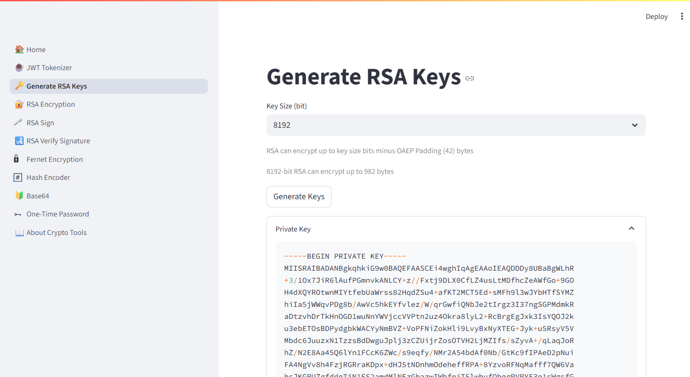

# Crypto Toolbox
An open-source toolbox for daily cryptography needs which is developed in Python using Streamlit platform.

## Apps
### JWT - JSON Web Token
Encoding/Decoding JWT tokens using different encryption algorithms and parameters.

### RSA Key Generator
Generating RSA Private and Public Keys.

### RSA Data Encryptor/Decryptor
Encrypting data using public key and decrypting using private key.

### RSA Digital Signature
Signing files using RSA private key.

### RSA Signature Validator
Validating the digital signature using RSA public key. The digital signature has been generated using private key.

### Fernet
Encrypting/Decrypting files using Fernet.

### Hash Algorithms
Encoding a file or a text using `sha1`, `sha224`, `sha256`, `sha384`, `sha512`, `sha3_224`, `sha3_256`, `sha3_384`,
`sha3_512`, `shake_128`, `shake_256`, `blake2b`, `blake2s`, and `md5`.

### Base64
Encoding/Decoding files/text using Base64.

### One-Time Password (OTP)
Time-Based and Counter-Based One-Time Passwords based on Base32 secret.

## Screenshot

___
## Run
In order to run this app, you need to install the dependencies first based on
the `_environment.yml` or `requirements.txt` files. Once the dependencies are installed, run the dashboard using
`streamlit`.

    streamlit run ./main.py

### Run on Docker
This application is available on [Docker Hub](https://hub.docker.com/r/kavehbc/crypto-tools), and it can be run directly using:

    docker run -p 80:8501 kavehbc/crypto-tools

Once you run it, you can open it in your browser on [http://127.0.0.1](http://127.0.0.1).

### Live demo
You can check its live demo here:
[https://crypto-tools.streamlit.app](https://crypto-tools.streamlit.app)

___
## GitHub Repo
This project is open-source, and it is available on Github at [https://github.com/kavehbc/crypto-tools](https://github.com/kavehbc/crypto-tools).

## Developer(s)
Kaveh Bakhtiyari - [Website](http://bakhtiyari.com) | [Medium](https://medium.com/@bakhtiyari)
  | [LinkedIn](https://www.linkedin.com/in/bakhtiyari) | [GitHub](https://github.com/kavehbc)

## Contribution
Feel free to join the open-source community and contribute to this repository.
